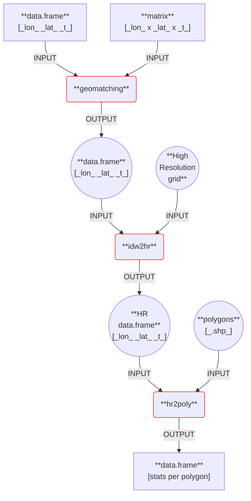

# geotools

## Authors
- **Alessandro FASSÒ**, University of Bergamo (alessandro.fasso@unibg.it).
- **Alessandro FUSTA MORO**, University of Bergamo (alessandro.fustamoro@unibg.it).
- **Lorenzo LEONI**, University of Bergamo (lorenzo.leoni1998@gmail.com).

## Description
The ```geotools``` package is an R library designed to simplify the management, analysis, and processing of space-time data. In particular, it provides a comprehensive set of modules that enable the computation of statistics for space-time variables (e.g., meteorological and air quality data) whose values are available on a spatial grid at the polygonal scale (e.g., municipal or regional).

## Overview
The ```geotools``` R package is structured as follows:
- ```geomatching```: maps input space-time data from different spatial grids onto a specific common grid, even when their geographic reference systems may differ. This procedure is known as **spatial overlay**. It can handle two input data formats: R dataframe or matrix.
- ```idw2hr```: maps input space-time data onto a high-resolution spatial grid using **IDW** (**Inverse Distance Weighting**). The goal is to assign (interpolated) observations within the boundaries of smaller municipalities (which are polygons) as well.
- ```hr2poly```: maps input high-resolution space-time data onto polygons and computes the user-specified statistics (e.g., mean, median, and standard deviation) for each space-time variable.
- ```df2poly```: executes consecutively ```geomatching```, ```idw2hr```, and ```hr2poly```.

## Flowchart
