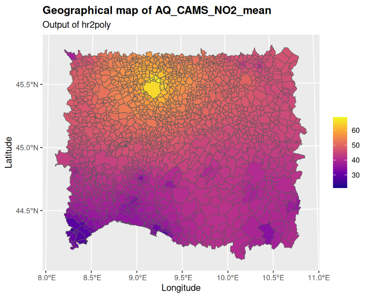

# Geo tools for R



## Authors
- **Alessandro FASSÒ**, University of Bergamo (alessandro.fasso@unibg.it).
- **Alessandro FUSTA MORO**, University of Bergamo (alessandro.fustamoro@unibg.it).
- **Lorenzo LEONI**, University of Bergamo (lorenzo.leoni1998@gmail.com).

## Description
The ```geotools``` package is an R library designed to simplify the management, analysis, and processing of space-time data. In particular, it provides a comprehensive set of modules that enable the computation of statistics for space-time variables (e.g., meteorological and air quality data) whose values are available on a spatial grid at the polygonal scale (e.g., municipal or regional).

## Installation
Install the ```geotools``` package via GitHub:
``` r
# install.packages("devtools")
devtools::install_github("GRINS-Spoke0-WP2/geotools")
library(geotools)
``` 

## Overview
The ```geotools``` R package is structured as follows:
| **Function** | **Description** | **Available** |
|:------------:|:----------------|:-------------:|
| ```geomatching``` | Maps input space-time data from different spatial grids onto a specific common grid, even when their geographic reference systems may differ. This procedure is known as **spatial overlay**. It can handle two input data formats: R dataframe or matrix | Yes |
| ```idw2hr``` | Maps input space-time data onto a high-resolution spatial grid using **IDW** (**Inverse Distance Weighting**). The goal is to assign (interpolated) observations within the boundaries of smaller municipalities (which are polygons) as well | Yes |
| ```hr2poly``` | Maps input high-resolution space-time data onto polygons and computes the user-specified statistics (e.g., mean, median, and standard deviation) for each space-time variable | Yes |
| ```df2poly``` | Executes consecutively ```geomatching```, ```idw2hr```, and ```hr2poly``` | Coming soon |

## Flowchart


